# An example of coding knowledge for Matplotlib

# Dependents
***


```python
import numpy as np
import matplotlib.pyplot as plt
import pandas as pd
import seaborn as sns
```

# Loading the raw data and merging the datasets
***


```python
mouse_data = 'mouse_drug_data.csv'
clinical_data = 'clinicaltrial_data.csv'
```


```python
mouse_data_df = pd.read_csv(mouse_data, encoding = 'ISO-8859-1')
clinical_data_df = pd.read_csv(clinical_data, encoding = 'ISO-8859-1')
```


```python
clinical_mouse_data_df = pd.merge(clinical_data_df, mouse_data_df, on='Mouse ID', how='outer')
```

# Tumor Volume Change for each treatment over time
***


```python
# I am starting this exercise by looking at the 10 drugs and their means over time. I'm not certain that graphing means
# models 'real' analysis given the highs/lows from subject to subject.
# Also showing all 10 drugs on one chart is busy.
groupby_clinical_mouse_data_df = clinical_mouse_data_df.groupby(['Drug','Timepoint']).mean()
groupby_clinical_mouse_data_df = groupby_clinical_mouse_data_df.reset_index('Timepoint')
x = groupby_clinical_mouse_data_df['Timepoint']
y = groupby_clinical_mouse_data_df['Tumor Volume (mm3)']
plt.plot(x, y, marker='+', color='blue', markersize=5, linewidth=.5, linestyle='--')
plt.grid(True, color='gray', linestyle=':', linewidth=1)
plt.ylabel("Size of Tumor", size=10)
plt.xlabel("Timepoint", size=10)
plt.title('Clinical Trial Performance', size=17)
plt.show()
```


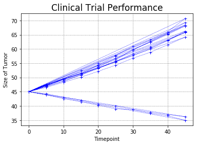


```python
groupby_clinical_mouse_data_df
```


<div>
<style>
    .dataframe thead tr:only-child th {
        text-align: right;
    }

    .dataframe thead th {
        text-align: left;
    }

    .dataframe tbody tr th {
        vertical-align: top;
    }
</style>
<table border="1" class="dataframe">
  <thead>
    <tr style="text-align: right;">
      <th></th>
      <th>Timepoint</th>
      <th>Tumor Volume (mm3)</th>
      <th>Metastatic Sites</th>
    </tr>
    <tr>
      <th>Drug</th>
      <th></th>
      <th></th>
      <th></th>
    </tr>
  </thead>
  <tbody>
    <tr>
      <th>Capomulin</th>
      <td>0</td>
      <td>45.000000</td>
      <td>0.000000</td>
    </tr>
    <tr>
      <th>Capomulin</th>
      <td>5</td>
      <td>44.266086</td>
      <td>0.160000</td>
    </tr>
    <tr>
      <th>Capomulin</th>
      <td>10</td>
      <td>43.084291</td>
      <td>0.320000</td>
    </tr>
    <tr>
      <th>Capomulin</th>
      <td>15</td>
      <td>42.064317</td>
      <td>0.375000</td>
    </tr>
    <tr>
      <th>Capomulin</th>
      <td>20</td>
      <td>40.716325</td>
      <td>0.652174</td>
    </tr>
    <tr>
      <th>Capomulin</th>
      <td>25</td>
      <td>39.939528</td>
      <td>0.818182</td>
    </tr>
    <tr>
      <th>Capomulin</th>
      <td>30</td>
      <td>38.769339</td>
      <td>1.090909</td>
    </tr>
    <tr>
      <th>Capomulin</th>
      <td>35</td>
      <td>37.816839</td>
      <td>1.181818</td>
    </tr>
    <tr>
      <th>Capomulin</th>
      <td>40</td>
      <td>36.958001</td>
      <td>1.380952</td>
    </tr>
    <tr>
      <th>Capomulin</th>
      <td>45</td>
      <td>36.236114</td>
      <td>1.476190</td>
    </tr>
    <tr>
      <th>Ceftamin</th>
      <td>0</td>
      <td>45.000000</td>
      <td>0.000000</td>
    </tr>
    <tr>
      <th>Ceftamin</th>
      <td>5</td>
      <td>46.503051</td>
      <td>0.380952</td>
    </tr>
    <tr>
      <th>Ceftamin</th>
      <td>10</td>
      <td>48.285125</td>
      <td>0.600000</td>
    </tr>
    <tr>
      <th>Ceftamin</th>
      <td>15</td>
      <td>50.094055</td>
      <td>0.789474</td>
    </tr>
    <tr>
      <th>Ceftamin</th>
      <td>20</td>
      <td>52.157049</td>
      <td>1.111111</td>
    </tr>
    <tr>
      <th>Ceftamin</th>
      <td>25</td>
      <td>54.287674</td>
      <td>1.500000</td>
    </tr>
    <tr>
      <th>Ceftamin</th>
      <td>30</td>
      <td>56.769517</td>
      <td>1.937500</td>
    </tr>
    <tr>
      <th>Ceftamin</th>
      <td>35</td>
      <td>58.827548</td>
      <td>2.071429</td>
    </tr>
    <tr>
      <th>Ceftamin</th>
      <td>40</td>
      <td>61.467895</td>
      <td>2.357143</td>
    </tr>
    <tr>
      <th>Ceftamin</th>
      <td>45</td>
      <td>64.132421</td>
      <td>2.692308</td>
    </tr>
    <tr>
      <th>Infubinol</th>
      <td>0</td>
      <td>45.000000</td>
      <td>0.000000</td>
    </tr>
    <tr>
      <th>Infubinol</th>
      <td>5</td>
      <td>47.062001</td>
      <td>0.280000</td>
    </tr>
    <tr>
      <th>Infubinol</th>
      <td>10</td>
      <td>49.403909</td>
      <td>0.666667</td>
    </tr>
    <tr>
      <th>Infubinol</th>
      <td>15</td>
      <td>51.296397</td>
      <td>0.904762</td>
    </tr>
    <tr>
      <th>Infubinol</th>
      <td>20</td>
      <td>53.197691</td>
      <td>1.050000</td>
    </tr>
    <tr>
      <th>Infubinol</th>
      <td>25</td>
      <td>55.715252</td>
      <td>1.277778</td>
    </tr>
    <tr>
      <th>Infubinol</th>
      <td>30</td>
      <td>58.299397</td>
      <td>1.588235</td>
    </tr>
    <tr>
      <th>Infubinol</th>
      <td>35</td>
      <td>60.742461</td>
      <td>1.666667</td>
    </tr>
    <tr>
      <th>Infubinol</th>
      <td>40</td>
      <td>63.162824</td>
      <td>2.100000</td>
    </tr>
    <tr>
      <th>Infubinol</th>
      <td>45</td>
      <td>65.755562</td>
      <td>2.111111</td>
    </tr>
    <tr>
      <th>...</th>
      <td>...</td>
      <td>...</td>
      <td>...</td>
    </tr>
    <tr>
      <th>Ramicane</th>
      <td>0</td>
      <td>45.000000</td>
      <td>0.000000</td>
    </tr>
    <tr>
      <th>Ramicane</th>
      <td>5</td>
      <td>43.944859</td>
      <td>0.120000</td>
    </tr>
    <tr>
      <th>Ramicane</th>
      <td>10</td>
      <td>42.531957</td>
      <td>0.250000</td>
    </tr>
    <tr>
      <th>Ramicane</th>
      <td>15</td>
      <td>41.495061</td>
      <td>0.333333</td>
    </tr>
    <tr>
      <th>Ramicane</th>
      <td>20</td>
      <td>40.238325</td>
      <td>0.347826</td>
    </tr>
    <tr>
      <th>Ramicane</th>
      <td>25</td>
      <td>38.974300</td>
      <td>0.652174</td>
    </tr>
    <tr>
      <th>Ramicane</th>
      <td>30</td>
      <td>38.703137</td>
      <td>0.782609</td>
    </tr>
    <tr>
      <th>Ramicane</th>
      <td>35</td>
      <td>37.451996</td>
      <td>0.952381</td>
    </tr>
    <tr>
      <th>Ramicane</th>
      <td>40</td>
      <td>36.574081</td>
      <td>1.100000</td>
    </tr>
    <tr>
      <th>Ramicane</th>
      <td>45</td>
      <td>34.955595</td>
      <td>1.250000</td>
    </tr>
    <tr>
      <th>Stelasyn</th>
      <td>0</td>
      <td>45.000000</td>
      <td>0.000000</td>
    </tr>
    <tr>
      <th>Stelasyn</th>
      <td>5</td>
      <td>47.527452</td>
      <td>0.240000</td>
    </tr>
    <tr>
      <th>Stelasyn</th>
      <td>10</td>
      <td>49.463844</td>
      <td>0.478261</td>
    </tr>
    <tr>
      <th>Stelasyn</th>
      <td>15</td>
      <td>51.529409</td>
      <td>0.782609</td>
    </tr>
    <tr>
      <th>Stelasyn</th>
      <td>20</td>
      <td>54.067395</td>
      <td>0.952381</td>
    </tr>
    <tr>
      <th>Stelasyn</th>
      <td>25</td>
      <td>56.166123</td>
      <td>1.157895</td>
    </tr>
    <tr>
      <th>Stelasyn</th>
      <td>30</td>
      <td>59.826738</td>
      <td>1.388889</td>
    </tr>
    <tr>
      <th>Stelasyn</th>
      <td>35</td>
      <td>62.440699</td>
      <td>1.562500</td>
    </tr>
    <tr>
      <th>Stelasyn</th>
      <td>40</td>
      <td>65.356386</td>
      <td>1.583333</td>
    </tr>
    <tr>
      <th>Stelasyn</th>
      <td>45</td>
      <td>68.438310</td>
      <td>1.727273</td>
    </tr>
    <tr>
      <th>Zoniferol</th>
      <td>0</td>
      <td>45.000000</td>
      <td>0.000000</td>
    </tr>
    <tr>
      <th>Zoniferol</th>
      <td>5</td>
      <td>46.851818</td>
      <td>0.166667</td>
    </tr>
    <tr>
      <th>Zoniferol</th>
      <td>10</td>
      <td>48.689881</td>
      <td>0.500000</td>
    </tr>
    <tr>
      <th>Zoniferol</th>
      <td>15</td>
      <td>50.779059</td>
      <td>0.809524</td>
    </tr>
    <tr>
      <th>Zoniferol</th>
      <td>20</td>
      <td>53.170334</td>
      <td>1.294118</td>
    </tr>
    <tr>
      <th>Zoniferol</th>
      <td>25</td>
      <td>55.432935</td>
      <td>1.687500</td>
    </tr>
    <tr>
      <th>Zoniferol</th>
      <td>30</td>
      <td>57.713531</td>
      <td>1.933333</td>
    </tr>
    <tr>
      <th>Zoniferol</th>
      <td>35</td>
      <td>60.089372</td>
      <td>2.285714</td>
    </tr>
    <tr>
      <th>Zoniferol</th>
      <td>40</td>
      <td>62.916692</td>
      <td>2.785714</td>
    </tr>
    <tr>
      <th>Zoniferol</th>
      <td>45</td>
      <td>65.960888</td>
      <td>3.071429</td>
    </tr>
  </tbody>
</table>
<p>100 rows × 3 columns</p>
</div>


```python
# Showing the means of 5 of the drugs presents a more readable chart
groupby_clinical_mouse_data_df = clinical_mouse_data_df.groupby(['Drug','Timepoint']).mean()
groupby_clinical_mouse_data_df = groupby_clinical_mouse_data_df.reset_index(['Drug', 'Timepoint'])
fig, ax = plt.subplots()
groupby_clinical_mouse_data_df[groupby_clinical_mouse_data_df['Drug'] == 'Capomulin'].plot(x='Timepoint', y='Tumor Volume (mm3)', markersize=5, color='blue', linestyle='--', ax=ax, marker='>', label='Capomulin')
groupby_clinical_mouse_data_df[groupby_clinical_mouse_data_df['Drug'] == 'Placebo'].plot(x='Timepoint', y='Tumor Volume (mm3)', markersize=5, color='red', linestyle='--', ax=ax, marker='^', label='Placebo')
groupby_clinical_mouse_data_df[groupby_clinical_mouse_data_df['Drug'] == 'Stelasyn'].plot(x='Timepoint', y='Tumor Volume (mm3)', markersize=5, color='green', linestyle='--', ax=ax, marker='<', label='Stelasyn')
groupby_clinical_mouse_data_df[groupby_clinical_mouse_data_df['Drug'] == 'Naftisol'].plot(x='Timepoint', y='Tumor Volume (mm3)', markersize=5, color='black', linestyle='--', ax=ax, marker='o', label='Naftisol')
groupby_clinical_mouse_data_df[groupby_clinical_mouse_data_df['Drug'] == 'Infubinol'].plot(x='Timepoint', y='Tumor Volume (mm3)', markersize=5, color='orange', linestyle='--', ax=ax, marker='+', label='Infubinol')
plt.grid(True, color='gray', linestyle='-', linewidth=.5)
plt.ylabel("Size of Tumor", size=10)
plt.xlabel("Timepoint", size=10)
plt.title('Clinical Trial Performance', size=17)
plt.show()
```


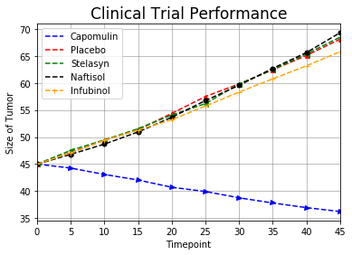


```python
# Showing the means of the last 5 drugs presents the rest of the story
groupby_clinical_mouse_data_df = clinical_mouse_data_df.groupby(['Drug','Timepoint']).mean()
groupby_clinical_mouse_data_df = groupby_clinical_mouse_data_df.reset_index(['Drug', 'Timepoint'])
fig, ax = plt.subplots()
groupby_clinical_mouse_data_df[groupby_clinical_mouse_data_df['Drug'] == 'Ramicane'].plot(x='Timepoint', y='Tumor Volume (mm3)', markersize=5, color='blue', linestyle='--', ax=ax, marker='>', label='Ramicane')
groupby_clinical_mouse_data_df[groupby_clinical_mouse_data_df['Drug'] == 'Ketapril'].plot(x='Timepoint', y='Tumor Volume (mm3)', markersize=5, color='red', linestyle='--', ax=ax, marker='^', label='Ketapril')
groupby_clinical_mouse_data_df[groupby_clinical_mouse_data_df['Drug'] == 'Ceftamin'].plot(x='Timepoint', y='Tumor Volume (mm3)', markersize=5, color='green', linestyle='--', ax=ax, marker='<', label='Ceftamin')
groupby_clinical_mouse_data_df[groupby_clinical_mouse_data_df['Drug'] == 'Propriva'].plot(x='Timepoint', y='Tumor Volume (mm3)', markersize=5, color='black', linestyle='--', ax=ax, marker='o', label='Propriva')
groupby_clinical_mouse_data_df[groupby_clinical_mouse_data_df['Drug'] == 'Stelasyn'].plot(x='Timepoint', y='Tumor Volume (mm3)', markersize=5, color='orange', linestyle='--', ax=ax, marker='+', label='Stelasyn')
plt.grid(True, color='gray', linestyle='-', linewidth=.5)
plt.ylabel("Size of Tumor", size=10)
plt.xlabel("Timepoint", size=10)
plt.title('Clinical Trial Performance', size=17)
plt.show()
```


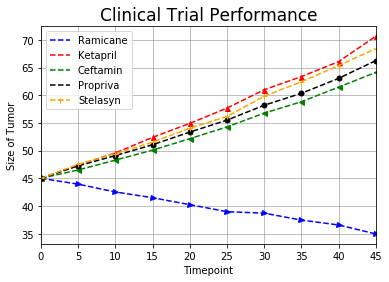


```python
# Showing the performance of the 2 best drugs vs. placebo
groupby_clinical_mouse_data_df = clinical_mouse_data_df.groupby(['Drug','Timepoint']).mean()
groupby_clinical_mouse_data_df = groupby_clinical_mouse_data_df.reset_index(['Drug', 'Timepoint'])
fig, ax = plt.subplots()
groupby_clinical_mouse_data_df[groupby_clinical_mouse_data_df['Drug'] == 'Ramicane'].plot(x='Timepoint', y='Tumor Volume (mm3)', markersize=5, color='green', linestyle='--', ax=ax, marker='<', label='Ramicane')
groupby_clinical_mouse_data_df[groupby_clinical_mouse_data_df['Drug'] == 'Capomulin'].plot(x='Timepoint', y='Tumor Volume (mm3)', markersize=5, color='blue', linestyle='--', ax=ax, marker='>', label='Capomulin')
groupby_clinical_mouse_data_df[groupby_clinical_mouse_data_df['Drug'] == 'Placebo'].plot(x='Timepoint', y='Tumor Volume (mm3)', markersize=5, color='red', linestyle='--', ax=ax, marker='^', label='Placebo')
plt.grid(True, color='gray', linestyle='-', linewidth=.5)
plt.ylabel("Size of Tumor", size=10)
plt.xlabel("Timepoint", size=10)
plt.title('Clinical Trial Performance', size=17)
plt.show()
```


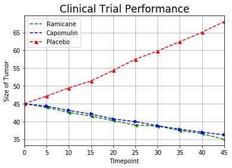


```python
# 10 drugs or treatments, spread across 25 mice.  I chose to line plot all of the data.
# The 1900 individual data points don't tell a story so more analysis is needed.
x = clinical_mouse_data_df['Timepoint']
y = clinical_mouse_data_df['Tumor Volume (mm3)']
plt.plot(x, y, marker='+', color='mediumvioletred', markersize=4, linewidth=.05)
plt.grid(True, color='gray', linestyle='-', linewidth=1)
plt.ylabel("Size of Tumor", size=10)
plt.xlabel("Timepoint", size=10)
plt.title('Clinical Trial Performance', size=17)
plt.show()
```


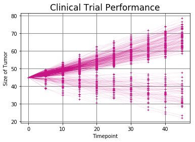


```python
# 10 drugs or treatments, spread across 25 mice.  A scatter plot begins to show trends.
x = clinical_mouse_data_df['Timepoint']
y = clinical_mouse_data_df['Tumor Volume (mm3)']
plt.scatter(x, y, marker='o', color='blue')
plt.grid(True, color='gray', linestyle='-', linewidth=.5)
plt.ylabel("Size of Tumor", size=10)
plt.xlabel("Timepoint", size=10)
plt.title('Clinical Trial Performance', size=17)
plt.show()
```


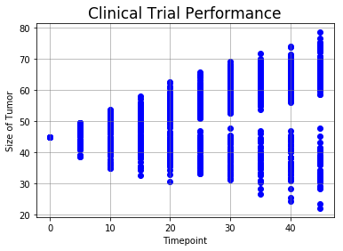


```python
# Plotting 2 drugs to show the power of scatter plots and the use of subplots
fig, ax = plt.subplots()
clinical_mouse_data_df[clinical_mouse_data_df['Drug'] == 'Capomulin'].plot(x='Timepoint', y='Tumor Volume (mm3)', color='blue', linestyle='None', ax=ax, marker='+', label='Capomulin')
clinical_mouse_data_df[clinical_mouse_data_df['Drug'] == 'Placebo'].plot(x='Timepoint', y='Tumor Volume (mm3)', color='red', linestyle='None', ax=ax, marker='o', label='Placebo')
plt.grid(True, color='gray', linestyle='-', linewidth=.5)
plt.show()
```


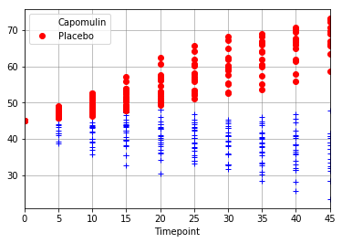


```python
# Using a different subplot tool that allows for sharing axis.
fig, (ax1, ax2) = plt.subplots(nrows=2, ncols=1, sharex='all', figsize=(7,9))
clinical_mouse_data_df[clinical_mouse_data_df['Drug'] == 'Capomulin'].plot(x='Timepoint', y='Tumor Volume (mm3)', markerfacecolor='g', linestyle='None', ax=ax1, marker='+', label='Capomulin')
ax1.set_title('Capomulin')
plt.grid(True, color='green', linestyle='-', linewidth=.5)
clinical_mouse_data_df[clinical_mouse_data_df['Drug'] == 'Placebo'].plot(x='Timepoint', y='Tumor Volume (mm3)', markerfacecolor='b', linestyle='None', ax=ax2, marker='o', label='Placebo')
ax2.set_title('Placebo')
plt.show()
```


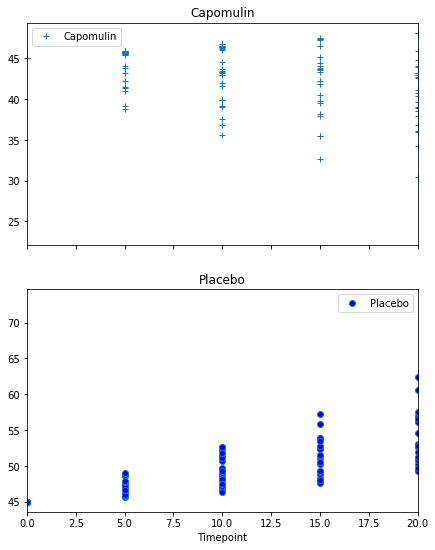


```python
# Having built confidence I'm using subplots to all data for 5 drugs...allowing the viewer to see the trends
fig, (ax1, ax2, ax3, ax4, ax5) = plt.subplots(nrows=5, ncols=1, sharex='all', figsize=(7,9))
clinical_mouse_data_df[clinical_mouse_data_df['Drug'] == 'Stelasyn'].plot(x='Timepoint', y='Tumor Volume (mm3)', markerfacecolor='black', linestyle='None', ax=ax1, marker='+', label='Stelasyn')
ax1.set_title('Stelasyn')
clinical_mouse_data_df[clinical_mouse_data_df['Drug'] == 'Naftisol'].plot(x='Timepoint', y='Tumor Volume (mm3)', markerfacecolor='black', linestyle='None', ax=ax2, marker='^', label='Naftisol')
ax2.set_title('Naftisol')
clinical_mouse_data_df[clinical_mouse_data_df['Drug'] == 'Ketapril'].plot(x='Timepoint', y='Tumor Volume (mm3)', markerfacecolor='black', linestyle='None', ax=ax3, marker='+', label='Ketapril')
ax3.set_title('Ketapril')
clinical_mouse_data_df[clinical_mouse_data_df['Drug'] == 'Infubinol'].plot(x='Timepoint', y='Tumor Volume (mm3)', markerfacecolor='black', linestyle='None', ax=ax4, marker='*', label='Infubinol')
ax4.set_title('Infubinol')
clinical_mouse_data_df[clinical_mouse_data_df['Drug'] == 'Ramicane'].plot(x='Timepoint', y='Tumor Volume (mm3)', markerfacecolor='black', linestyle='None', ax=ax5, marker='v', label='Ramicane')
ax5.set_title('Ramicane')
plt.tight_layout()
plt.show()
```

    /Users/jeffmoore/anaconda3/lib/python3.6/site-packages/matplotlib/axes/_base.py:2918: UserWarning: Attempting to set identical left==right results
    in singular transformations; automatically expanding.
    left=0.0, right=0.0
      'left=%s, right=%s') % (left, right))


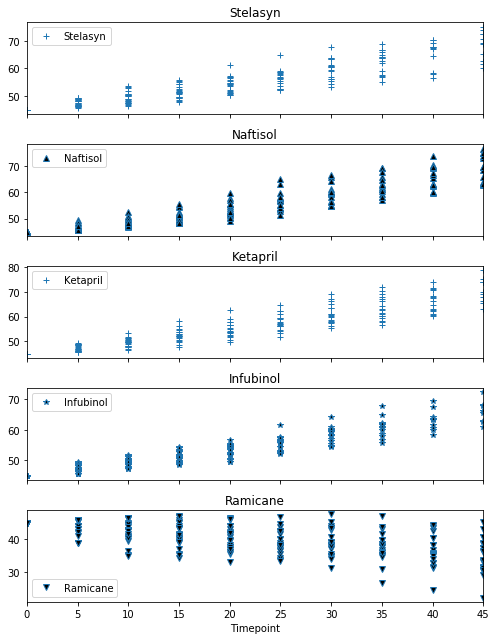


```python
# Showing the remaining 5 drugs
fig, (ax6, ax7, ax8, ax9, ax10) = plt.subplots(nrows=5, ncols=1, sharex='all', figsize=(7,9))
clinical_mouse_data_df[clinical_mouse_data_df['Drug'] == 'Ceftamin'].plot(x='Timepoint', y='Tumor Volume (mm3)', markerfacecolor='black', linestyle='None', ax=ax6, marker='>', label='Ceftamin')
ax6.set_title('Ceftamin')
clinical_mouse_data_df[clinical_mouse_data_df['Drug'] == 'Propriva'].plot(x='Timepoint', y='Tumor Volume (mm3)', markerfacecolor='black', linestyle='None', ax=ax7, marker='^', label='Propriva')
ax7.set_title('Propriva')
clinical_mouse_data_df[clinical_mouse_data_df['Drug'] == 'Capomulin'].plot(x='Timepoint', y='Tumor Volume (mm3)', markerfacecolor='black', linestyle='None', ax=ax8, marker='+', label='Capomulin')
ax8.set_title('Capomulin')
clinical_mouse_data_df[clinical_mouse_data_df['Drug'] == 'Placebo'].plot(x='Timepoint', y='Tumor Volume (mm3)', markerfacecolor='black', linestyle='None', ax=ax9, marker='*', label='Placebo')
ax9.set_title('Placebo')
clinical_mouse_data_df[clinical_mouse_data_df['Drug'] == 'Zoniferol'].plot(x='Timepoint', y='Tumor Volume (mm3)', markerfacecolor='black', linestyle='None', ax=ax10, marker='v', label='Zoniferol')
ax10.set_title('Zoniferol')
plt.tight_layout()
ax10.set_xlim([0, 45])
plt.show()
```

    /Users/jeffmoore/anaconda3/lib/python3.6/site-packages/matplotlib/axes/_base.py:2918: UserWarning: Attempting to set identical left==right results
    in singular transformations; automatically expanding.
    left=0.0, right=0.0
      'left=%s, right=%s') % (left, right))


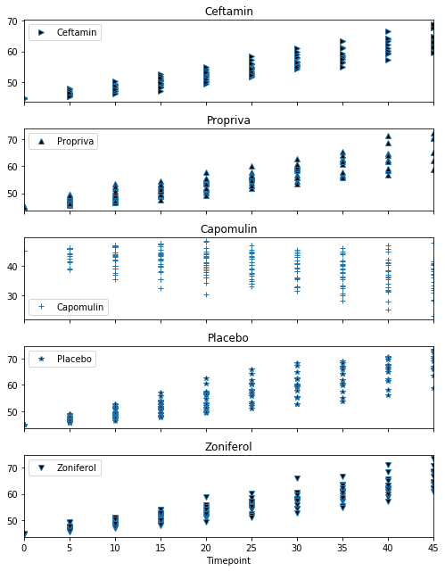


# Error Bars for Tumor Volume
***


```python
# Including error bars to highlight the impact of comparing means vs. using the raw data. My analysis includes
# both raw data and means analysis.  Good learning exercise.
error_data = clinical_mouse_data_df[['Drug', 'Timepoint', 'Tumor Volume (mm3)']]
error_data = error_data.groupby(by=['Timepoint'])
means = error_data.mean()
errors = error_data.std()
fig, ax = plt.subplots()
means.plot(yerr=errors, ax=ax, kind='bar', color='red')
ax.set_title('Error Bars - Tumor Volume', size=17)
ax.set_xlabel('Days', size=10)
ax.set_ylabel('Mean Size of Tumor - Plus Error', size=10)
ax.grid()
ax.legend(['Tumor Volume'], loc=2)
plt.show()
```


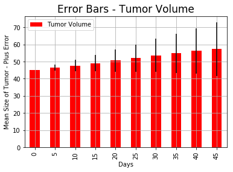


# Metastatic Site Analysis
***


```python
# Simply plotting all of the data doesn't show a trend.  Tough to perform any type of analysis.
x = clinical_mouse_data_df['Timepoint']
y = clinical_mouse_data_df['Metastatic Sites']
plt.scatter(x, y, marker='o')
plt.ylabel("# of Metastatic Sites", size=10)
plt.xlabel("Timepoint", size=10)
plt.title('# of Sites over Time', size=20)
plt.show()
```


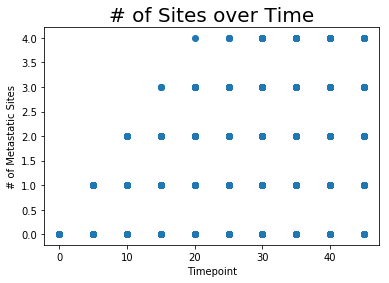


```python
# Using subplots allows us to perform analysis and spot trends.  I chose to plot 5 drugs at one time.
fig, (ax10, ax2, ax3, ax4, ax5) = plt.subplots(nrows=5, ncols=1, sharex='all', figsize=(7,9))
clinical_mouse_data_df[clinical_mouse_data_df['Drug'] == 'Stelasyn'].plot(x='Timepoint', y='Metastatic Sites', markerfacecolor='black', linestyle='None', ax=ax10, marker='.', label='Stelasyn')
ax10.set_title('Stelasyn')
clinical_mouse_data_df[clinical_mouse_data_df['Drug'] == 'Naftisol'].plot(x='Timepoint', y='Metastatic Sites', markerfacecolor='black', linestyle='None', ax=ax2, marker='2', label='Naftisol')
ax2.set_title('Naftisol')
clinical_mouse_data_df[clinical_mouse_data_df['Drug'] == 'Ketapril'].plot(x='Timepoint', y='Metastatic Sites', markerfacecolor='black', linestyle='None', ax=ax3, marker='+', label='Ketapril')
ax3.set_title('Ketapril')
clinical_mouse_data_df[clinical_mouse_data_df['Drug'] == 'Infubinol'].plot(x='Timepoint', y='Metastatic Sites', markerfacecolor='black', linestyle='None', ax=ax4, marker='*', label='Infubinol')
ax4.set_title('Infubinol')
clinical_mouse_data_df[clinical_mouse_data_df['Drug'] == 'Ramicane'].plot(x='Timepoint', y='Metastatic Sites', markerfacecolor='black', linestyle='None', ax=ax5, marker='v', label='Ramicane')
ax5.set_title('Ramicane')
plt.tight_layout()
plt.show()
```

    /Users/jeffmoore/anaconda3/lib/python3.6/site-packages/matplotlib/axes/_base.py:2918: UserWarning: Attempting to set identical left==right results
    in singular transformations; automatically expanding.
    left=0.0, right=0.0
      'left=%s, right=%s') % (left, right))


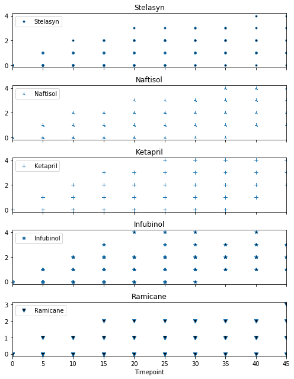


```python
fig, (ax1, ax6, ax7, ax8, ax9) = plt.subplots(nrows=5, ncols=1, sharex='all', figsize=(7,9))
clinical_mouse_data_df[clinical_mouse_data_df['Drug'] == 'Zoniferol'].plot(x='Timepoint', y='Metastatic Sites', markerfacecolor='black', linestyle='None', ax=ax1, marker='+', label='Zoniferol')
ax1.set_title('Zoniferol')
clinical_mouse_data_df[clinical_mouse_data_df['Drug'] == 'Ceftamin'].plot(x='Timepoint', y='Metastatic Sites', markerfacecolor='black', linestyle='None', ax=ax6, marker='o', label='Ceftamin')
ax6.set_title('Ceftamin')
clinical_mouse_data_df[clinical_mouse_data_df['Drug'] == 'Propriva'].plot(x='Timepoint', y='Metastatic Sites', markerfacecolor='black', linestyle='None', ax=ax7, marker='^', label='Propriva')
ax7.set_title('Propriva')
clinical_mouse_data_df[clinical_mouse_data_df['Drug'] == 'Capomulin'].plot(x='Timepoint', y='Metastatic Sites', markerfacecolor='black', linestyle='None', ax=ax8, marker='>', label='Capomulin')
ax8.set_title('Capomulin')
clinical_mouse_data_df[clinical_mouse_data_df['Drug'] == 'Placebo'].plot(x='Timepoint', y='Metastatic Sites', markerfacecolor='black', linestyle='None', ax=ax9, marker='<', label='Placebo')
ax9.set_title('Placebo')
plt.tight_layout()
plt.show()
```

    /Users/jeffmoore/anaconda3/lib/python3.6/site-packages/matplotlib/axes/_base.py:2918: UserWarning: Attempting to set identical left==right results
    in singular transformations; automatically expanding.
    left=0.0, right=0.0
      'left=%s, right=%s') % (left, right))


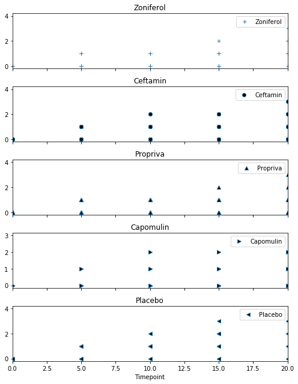


```python
# Lastly I chose to sum the points by Timepoint and plot that.  Really telling insights.
groupby_clinical_mouse_data_df = clinical_mouse_data_df.groupby(['Drug','Timepoint']).sum()
groupby_clinical_mouse_data_df = groupby_clinical_mouse_data_df.reset_index(['Drug', 'Timepoint'])
fig, ax = plt.subplots()
groupby_clinical_mouse_data_df[groupby_clinical_mouse_data_df['Drug'] == 'Capomulin'].plot(x='Timepoint', y='Metastatic Sites', markersize=5, color='blue', linestyle='--', ax=ax, marker='>', label='Capomulin')
groupby_clinical_mouse_data_df[groupby_clinical_mouse_data_df['Drug'] == 'Placebo'].plot(x='Timepoint', y='Metastatic Sites', markersize=5, color='red', linestyle='--', ax=ax, marker='^', label='Placebo')
groupby_clinical_mouse_data_df[groupby_clinical_mouse_data_df['Drug'] == 'Stelasyn'].plot(x='Timepoint', y='Metastatic Sites', markersize=5, color='green', linestyle='--', ax=ax, marker='<', label='Stelasyn')
groupby_clinical_mouse_data_df[groupby_clinical_mouse_data_df['Drug'] == 'Naftisol'].plot(x='Timepoint', y='Metastatic Sites', markersize=5, color='black', linestyle='--', ax=ax, marker='o', label='Naftisol')
groupby_clinical_mouse_data_df[groupby_clinical_mouse_data_df['Drug'] == 'Infubinol'].plot(x='Timepoint', y='Metastatic Sites', markersize=5, color='orange', linestyle='--', ax=ax, marker='+', label='Infubinol')
plt.grid(True, color='gray', linestyle='-', linewidth=.5)
plt.ylabel("# of Metastatic Sites", size=10)
plt.xlabel("Timepoint", size=10)
plt.title('# of Sites over Time', size=20)
plt.show()
```


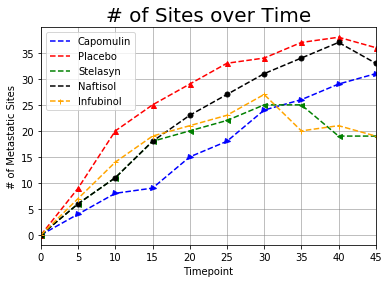


```python
fig, ax = plt.subplots()
groupby_clinical_mouse_data_df[groupby_clinical_mouse_data_df['Drug'] == 'Ramicane'].plot(x='Timepoint', y='Metastatic Sites', markersize=5, color='blue', linestyle='--', ax=ax, marker='>', label='Ramicane')
groupby_clinical_mouse_data_df[groupby_clinical_mouse_data_df['Drug'] == 'Ketapril'].plot(x='Timepoint', y='Metastatic Sites', markersize=5, color='red', linestyle='--', ax=ax, marker='^', label='Ketapril')
groupby_clinical_mouse_data_df[groupby_clinical_mouse_data_df['Drug'] == 'Ceftamin'].plot(x='Timepoint', y='Metastatic Sites', markersize=5, color='green', linestyle='--', ax=ax, marker='<', label='Ceftamin')
groupby_clinical_mouse_data_df[groupby_clinical_mouse_data_df['Drug'] == 'Propriva'].plot(x='Timepoint', y='Metastatic Sites', markersize=5, color='black', linestyle='--', ax=ax, marker='o', label='Propriva')
groupby_clinical_mouse_data_df[groupby_clinical_mouse_data_df['Drug'] == 'Stelasyn'].plot(x='Timepoint', y='Metastatic Sites', markersize=5, color='orange', linestyle='--', ax=ax, marker='+', label='Stelasyn')
plt.grid(True, color='gray', linestyle='-', linewidth=.5)
plt.ylabel("# of Metastatic Sites", size=10)
plt.xlabel("Timepoint", size=10)
plt.title('# of Sites over Time', size=20)
plt.show()
```


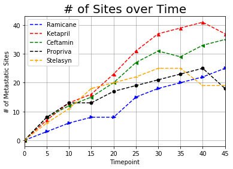


# Graph of Mouse Survival Rate over the 45 Days
***


```python
# Looking at value counts is an easy way to see the death rate or survival rate of the mice at each day regardless of
# the drug/treatment
death_rate = clinical_mouse_data_df['Timepoint'].value_counts()
death_rate = pd.DataFrame(data=death_rate)
death_rate = death_rate.rename(columns={'Timepoint':'Rate'})
x = np.arange(0,50,5)
plt.scatter(x, y=death_rate['Rate'])
plt.ylabel("# of Mice Living", size=10)
plt.xlabel("Day Count", size=10)
plt.title('Survival Rate', size=20)
plt.xlim(-1,50)
plt.ylim(120,260)
plt.show()
```


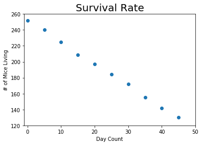


```python
# Graphing of survival rates by drug over the 45 day period
death_data_df = clinical_mouse_data_df.groupby(['Drug', 'Timepoint']).count()
death_data_df = death_data_df.reset_index(['Drug', 'Timepoint'])
fig, ax = plt.subplots()
death_data_df[death_data_df['Drug'] == 'Capomulin'].plot(x='Timepoint', y='Mouse ID', markersize=5, color='blue', linestyle='--', ax=ax, marker='>', label='Capomulin')
death_data_df[death_data_df['Drug'] == 'Placebo'].plot(x='Timepoint', y='Mouse ID', markersize=5, color='red', linestyle='--', ax=ax, marker='^', label='Placebo')
death_data_df[death_data_df['Drug'] == 'Stelasyn'].plot(x='Timepoint', y='Mouse ID', markersize=5, color='green', linestyle='--', ax=ax, marker='<', label='Stelasyn')
death_data_df[death_data_df['Drug'] == 'Naftisol'].plot(x='Timepoint', y='Mouse ID', markersize=5, color='black', linestyle='--', ax=ax, marker='o', label='Naftisol')
death_data_df[death_data_df['Drug'] == 'Infubinol'].plot(x='Timepoint', y='Mouse ID', markersize=5, color='orange', linestyle='--', ax=ax, marker='+', label='Infubinol')
plt.grid(True, color='gray', linestyle='-', linewidth=.5)
plt.ylabel("# of Mice Living", size=10)
plt.xlabel("Day Count", size=10)
plt.title('Survival Rate', size=20)
plt.show()
```


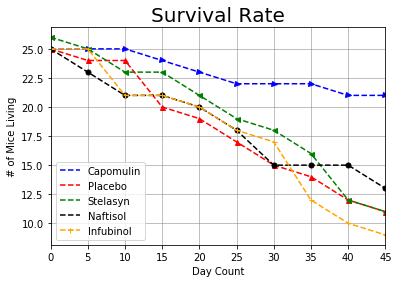


```python
fig, ax = plt.subplots()
death_data_df[death_data_df['Drug'] == 'Ramicane'].plot(x='Timepoint', y='Mouse ID', markersize=5, color='blue', linestyle='--', ax=ax, marker='>', label='Ramicane')
death_data_df[death_data_df['Drug'] == 'Ketapril'].plot(x='Timepoint', y='Mouse ID', markersize=5, color='red', linestyle='--', ax=ax, marker='^', label='Ketapril')
death_data_df[death_data_df['Drug'] == 'Ceftamin'].plot(x='Timepoint', y='Mouse ID', markersize=5, color='green', linestyle='--', ax=ax, marker='<', label='Ceftamin')
death_data_df[death_data_df['Drug'] == 'Propriva'].plot(x='Timepoint', y='Mouse ID', markersize=5, color='black', linestyle='--', ax=ax, marker='o', label='Propriva')
death_data_df[death_data_df['Drug'] == 'Stelasyn'].plot(x='Timepoint', y='Mouse ID', markersize=5, color='orange', linestyle='--', ax=ax, marker='+', label='Stelasyn')
plt.grid(True, color='gray', linestyle='-', linewidth=.5)
plt.ylabel("# of Mice Living", size=10)
plt.xlabel("Day Count", size=10)
plt.title('Survival Rate', size=20)
plt.show()
```


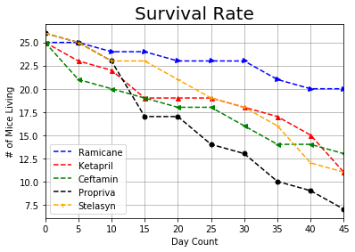


```python
death_data_df
```


<div>
<style>
    .dataframe thead tr:only-child th {
        text-align: right;
    }

    .dataframe thead th {
        text-align: left;
    }

    .dataframe tbody tr th {
        vertical-align: top;
    }
</style>
<table border="1" class="dataframe">
  <thead>
    <tr style="text-align: right;">
      <th></th>
      <th>Drug</th>
      <th>Timepoint</th>
      <th>Mouse ID</th>
      <th>Tumor Volume (mm3)</th>
      <th>Metastatic Sites</th>
    </tr>
  </thead>
  <tbody>
    <tr>
      <th>0</th>
      <td>Capomulin</td>
      <td>0</td>
      <td>25</td>
      <td>25</td>
      <td>25</td>
    </tr>
    <tr>
      <th>1</th>
      <td>Capomulin</td>
      <td>5</td>
      <td>25</td>
      <td>25</td>
      <td>25</td>
    </tr>
    <tr>
      <th>2</th>
      <td>Capomulin</td>
      <td>10</td>
      <td>25</td>
      <td>25</td>
      <td>25</td>
    </tr>
    <tr>
      <th>3</th>
      <td>Capomulin</td>
      <td>15</td>
      <td>24</td>
      <td>24</td>
      <td>24</td>
    </tr>
    <tr>
      <th>4</th>
      <td>Capomulin</td>
      <td>20</td>
      <td>23</td>
      <td>23</td>
      <td>23</td>
    </tr>
    <tr>
      <th>5</th>
      <td>Capomulin</td>
      <td>25</td>
      <td>22</td>
      <td>22</td>
      <td>22</td>
    </tr>
    <tr>
      <th>6</th>
      <td>Capomulin</td>
      <td>30</td>
      <td>22</td>
      <td>22</td>
      <td>22</td>
    </tr>
    <tr>
      <th>7</th>
      <td>Capomulin</td>
      <td>35</td>
      <td>22</td>
      <td>22</td>
      <td>22</td>
    </tr>
    <tr>
      <th>8</th>
      <td>Capomulin</td>
      <td>40</td>
      <td>21</td>
      <td>21</td>
      <td>21</td>
    </tr>
    <tr>
      <th>9</th>
      <td>Capomulin</td>
      <td>45</td>
      <td>21</td>
      <td>21</td>
      <td>21</td>
    </tr>
    <tr>
      <th>10</th>
      <td>Ceftamin</td>
      <td>0</td>
      <td>25</td>
      <td>25</td>
      <td>25</td>
    </tr>
    <tr>
      <th>11</th>
      <td>Ceftamin</td>
      <td>5</td>
      <td>21</td>
      <td>21</td>
      <td>21</td>
    </tr>
    <tr>
      <th>12</th>
      <td>Ceftamin</td>
      <td>10</td>
      <td>20</td>
      <td>20</td>
      <td>20</td>
    </tr>
    <tr>
      <th>13</th>
      <td>Ceftamin</td>
      <td>15</td>
      <td>19</td>
      <td>19</td>
      <td>19</td>
    </tr>
    <tr>
      <th>14</th>
      <td>Ceftamin</td>
      <td>20</td>
      <td>18</td>
      <td>18</td>
      <td>18</td>
    </tr>
    <tr>
      <th>15</th>
      <td>Ceftamin</td>
      <td>25</td>
      <td>18</td>
      <td>18</td>
      <td>18</td>
    </tr>
    <tr>
      <th>16</th>
      <td>Ceftamin</td>
      <td>30</td>
      <td>16</td>
      <td>16</td>
      <td>16</td>
    </tr>
    <tr>
      <th>17</th>
      <td>Ceftamin</td>
      <td>35</td>
      <td>14</td>
      <td>14</td>
      <td>14</td>
    </tr>
    <tr>
      <th>18</th>
      <td>Ceftamin</td>
      <td>40</td>
      <td>14</td>
      <td>14</td>
      <td>14</td>
    </tr>
    <tr>
      <th>19</th>
      <td>Ceftamin</td>
      <td>45</td>
      <td>13</td>
      <td>13</td>
      <td>13</td>
    </tr>
    <tr>
      <th>20</th>
      <td>Infubinol</td>
      <td>0</td>
      <td>25</td>
      <td>25</td>
      <td>25</td>
    </tr>
    <tr>
      <th>21</th>
      <td>Infubinol</td>
      <td>5</td>
      <td>25</td>
      <td>25</td>
      <td>25</td>
    </tr>
    <tr>
      <th>22</th>
      <td>Infubinol</td>
      <td>10</td>
      <td>21</td>
      <td>21</td>
      <td>21</td>
    </tr>
    <tr>
      <th>23</th>
      <td>Infubinol</td>
      <td>15</td>
      <td>21</td>
      <td>21</td>
      <td>21</td>
    </tr>
    <tr>
      <th>24</th>
      <td>Infubinol</td>
      <td>20</td>
      <td>20</td>
      <td>20</td>
      <td>20</td>
    </tr>
    <tr>
      <th>25</th>
      <td>Infubinol</td>
      <td>25</td>
      <td>18</td>
      <td>18</td>
      <td>18</td>
    </tr>
    <tr>
      <th>26</th>
      <td>Infubinol</td>
      <td>30</td>
      <td>17</td>
      <td>17</td>
      <td>17</td>
    </tr>
    <tr>
      <th>27</th>
      <td>Infubinol</td>
      <td>35</td>
      <td>12</td>
      <td>12</td>
      <td>12</td>
    </tr>
    <tr>
      <th>28</th>
      <td>Infubinol</td>
      <td>40</td>
      <td>10</td>
      <td>10</td>
      <td>10</td>
    </tr>
    <tr>
      <th>29</th>
      <td>Infubinol</td>
      <td>45</td>
      <td>9</td>
      <td>9</td>
      <td>9</td>
    </tr>
    <tr>
      <th>...</th>
      <td>...</td>
      <td>...</td>
      <td>...</td>
      <td>...</td>
      <td>...</td>
    </tr>
    <tr>
      <th>70</th>
      <td>Ramicane</td>
      <td>0</td>
      <td>25</td>
      <td>25</td>
      <td>25</td>
    </tr>
    <tr>
      <th>71</th>
      <td>Ramicane</td>
      <td>5</td>
      <td>25</td>
      <td>25</td>
      <td>25</td>
    </tr>
    <tr>
      <th>72</th>
      <td>Ramicane</td>
      <td>10</td>
      <td>24</td>
      <td>24</td>
      <td>24</td>
    </tr>
    <tr>
      <th>73</th>
      <td>Ramicane</td>
      <td>15</td>
      <td>24</td>
      <td>24</td>
      <td>24</td>
    </tr>
    <tr>
      <th>74</th>
      <td>Ramicane</td>
      <td>20</td>
      <td>23</td>
      <td>23</td>
      <td>23</td>
    </tr>
    <tr>
      <th>75</th>
      <td>Ramicane</td>
      <td>25</td>
      <td>23</td>
      <td>23</td>
      <td>23</td>
    </tr>
    <tr>
      <th>76</th>
      <td>Ramicane</td>
      <td>30</td>
      <td>23</td>
      <td>23</td>
      <td>23</td>
    </tr>
    <tr>
      <th>77</th>
      <td>Ramicane</td>
      <td>35</td>
      <td>21</td>
      <td>21</td>
      <td>21</td>
    </tr>
    <tr>
      <th>78</th>
      <td>Ramicane</td>
      <td>40</td>
      <td>20</td>
      <td>20</td>
      <td>20</td>
    </tr>
    <tr>
      <th>79</th>
      <td>Ramicane</td>
      <td>45</td>
      <td>20</td>
      <td>20</td>
      <td>20</td>
    </tr>
    <tr>
      <th>80</th>
      <td>Stelasyn</td>
      <td>0</td>
      <td>26</td>
      <td>26</td>
      <td>26</td>
    </tr>
    <tr>
      <th>81</th>
      <td>Stelasyn</td>
      <td>5</td>
      <td>25</td>
      <td>25</td>
      <td>25</td>
    </tr>
    <tr>
      <th>82</th>
      <td>Stelasyn</td>
      <td>10</td>
      <td>23</td>
      <td>23</td>
      <td>23</td>
    </tr>
    <tr>
      <th>83</th>
      <td>Stelasyn</td>
      <td>15</td>
      <td>23</td>
      <td>23</td>
      <td>23</td>
    </tr>
    <tr>
      <th>84</th>
      <td>Stelasyn</td>
      <td>20</td>
      <td>21</td>
      <td>21</td>
      <td>21</td>
    </tr>
    <tr>
      <th>85</th>
      <td>Stelasyn</td>
      <td>25</td>
      <td>19</td>
      <td>19</td>
      <td>19</td>
    </tr>
    <tr>
      <th>86</th>
      <td>Stelasyn</td>
      <td>30</td>
      <td>18</td>
      <td>18</td>
      <td>18</td>
    </tr>
    <tr>
      <th>87</th>
      <td>Stelasyn</td>
      <td>35</td>
      <td>16</td>
      <td>16</td>
      <td>16</td>
    </tr>
    <tr>
      <th>88</th>
      <td>Stelasyn</td>
      <td>40</td>
      <td>12</td>
      <td>12</td>
      <td>12</td>
    </tr>
    <tr>
      <th>89</th>
      <td>Stelasyn</td>
      <td>45</td>
      <td>11</td>
      <td>11</td>
      <td>11</td>
    </tr>
    <tr>
      <th>90</th>
      <td>Zoniferol</td>
      <td>0</td>
      <td>25</td>
      <td>25</td>
      <td>25</td>
    </tr>
    <tr>
      <th>91</th>
      <td>Zoniferol</td>
      <td>5</td>
      <td>24</td>
      <td>24</td>
      <td>24</td>
    </tr>
    <tr>
      <th>92</th>
      <td>Zoniferol</td>
      <td>10</td>
      <td>22</td>
      <td>22</td>
      <td>22</td>
    </tr>
    <tr>
      <th>93</th>
      <td>Zoniferol</td>
      <td>15</td>
      <td>21</td>
      <td>21</td>
      <td>21</td>
    </tr>
    <tr>
      <th>94</th>
      <td>Zoniferol</td>
      <td>20</td>
      <td>17</td>
      <td>17</td>
      <td>17</td>
    </tr>
    <tr>
      <th>95</th>
      <td>Zoniferol</td>
      <td>25</td>
      <td>16</td>
      <td>16</td>
      <td>16</td>
    </tr>
    <tr>
      <th>96</th>
      <td>Zoniferol</td>
      <td>30</td>
      <td>15</td>
      <td>15</td>
      <td>15</td>
    </tr>
    <tr>
      <th>97</th>
      <td>Zoniferol</td>
      <td>35</td>
      <td>14</td>
      <td>14</td>
      <td>14</td>
    </tr>
    <tr>
      <th>98</th>
      <td>Zoniferol</td>
      <td>40</td>
      <td>14</td>
      <td>14</td>
      <td>14</td>
    </tr>
    <tr>
      <th>99</th>
      <td>Zoniferol</td>
      <td>45</td>
      <td>14</td>
      <td>14</td>
      <td>14</td>
    </tr>
  </tbody>
</table>
<p>100 rows × 5 columns</p>
</div>


# Graphing Percent Change of Tumor Size (Bar Chart)
***


```python
# Using a neat percent change dataframe method to calculate the change from Day 1 to Day 45 for each drug
vol_change = clinical_mouse_data_df.groupby(by=('Drug', 'Timepoint')).sum()
vol_change = vol_change.reset_index(level=['Drug','Timepoint'])
percent_change = []
for name in drug_names:
    percent_value = vol_change[vol_change['Drug'] == name]['Tumor Volume (mm3)'].pct_change(periods=9)
    hold = percent_value.sum()*-100
    percent_change.append(hold)
```


```python
drug_names = vol_change['Drug'].unique()
y_pos = np.arange(0,10,1)
plt.bar(y_pos, percent_change, align='center', alpha=0.5, color='blue', width=.5)
plt.xticks(y_pos, drug_names)
plt.ylabel('Percent Change of Tumor Size', size=10)
plt.xlabel('Drugs', size=10)
plt.title('Bar Chart - Tumor Size % Change', size=17)
plt.xticks(rotation=90)
plt.grid()
plt.show()
```


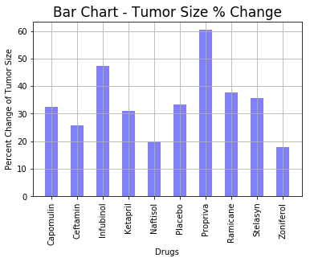

